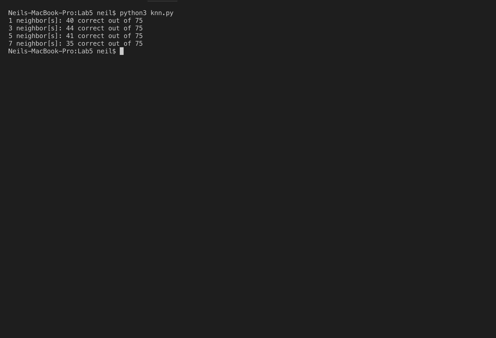
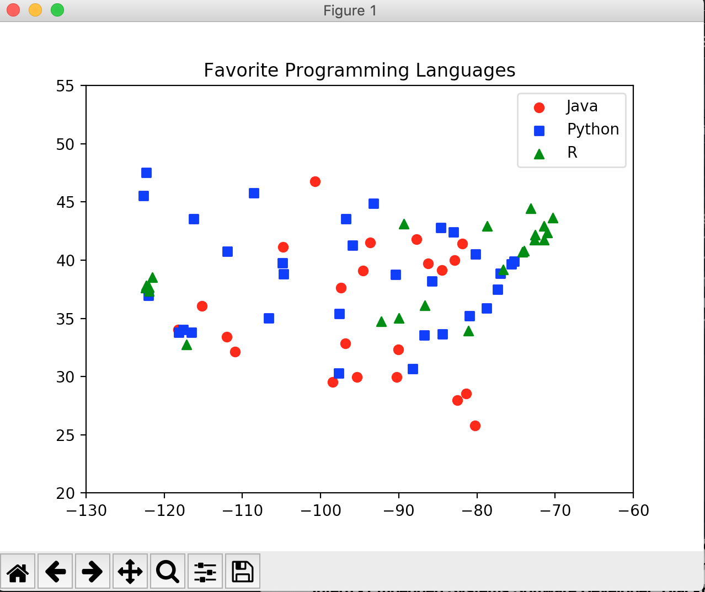
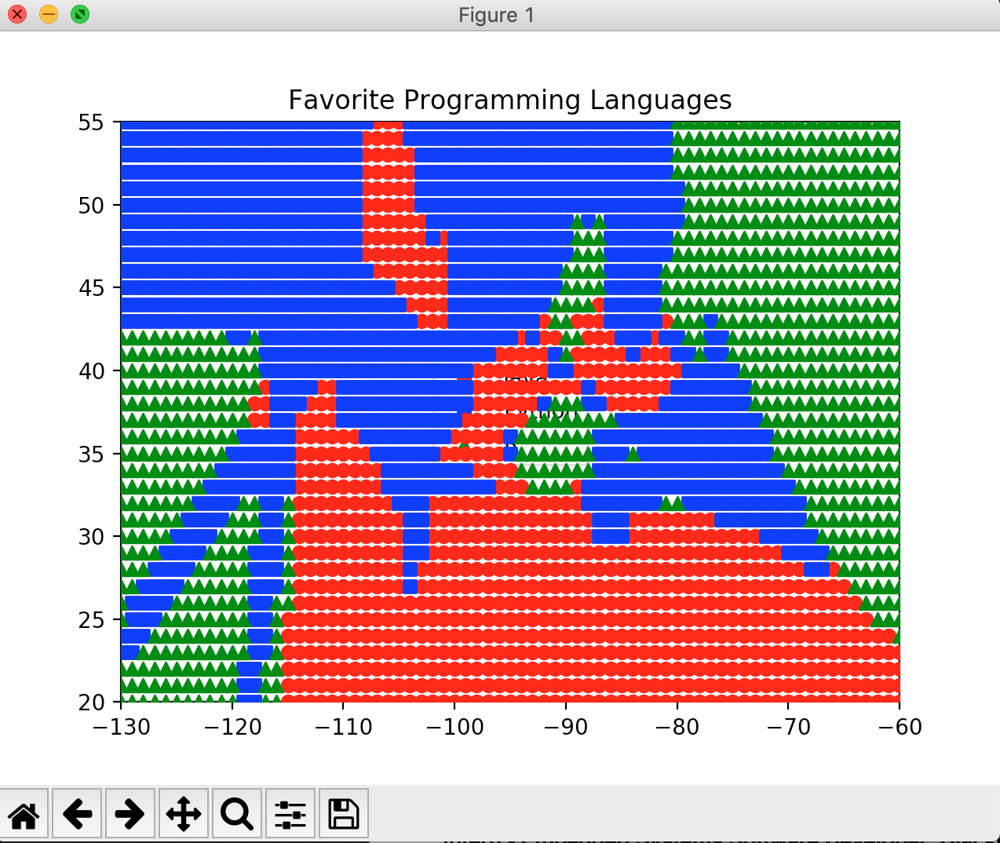
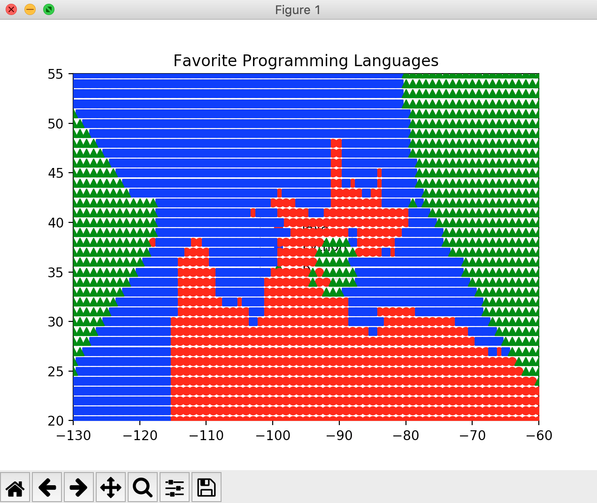

# cmpe255-spring19-lab5

KNN Classifier that classifies and plots the popular programming languages across USA for a given set of latitudes and longitudes.
A scatter series is then plotter based on KNN predictions. 

## Screenshots of usage
### Output predictions

### Original dataset plot

### Scatter series for k=1

### Scatter series for k=3

### Scatter series for k=5

